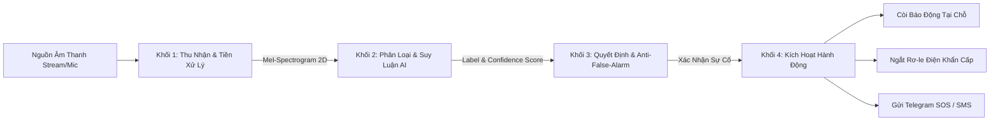

# 🚨 Hệ Thống Thông Minh Phát Hiện & Cảnh Báo Âm Thanh Nguy Hiểm Tích Hợp Cơ Chế Gửi Thông Báo Khẩn Cấp

> **Môn học:** Hệ Thống Thông Minh (HTTM)  
> **Đơn vị:** Học viện Công nghệ Bưu chính Viễn thông (PTIT)  
> **Slide Báo Cáo:** [slides.html](file:///d:/PTIT/Nam_4_1\HTTM\slides.html)  
> **Chi Tiết Tuần 1:** [Docs/Tuan1.md](file:///d:/PTIT/Nam_4_1\HTTM\Docs\Tuan1.md)

---

## 👥 Thành Viên Thực Hiện

| STT | Họ và Tên | Mã Sinh Viên | Vai trò |
| :---: | :--- | :---: | :--- |
| 1 | **Lê Thanh Thủy** | `B23DCCN809` | Thành viên nhóm |
| 2 | **Đặng Xuân Quang** | `B23DCCN686` | Thành viên nhóm |

---

## I. TỔNG QUAN DỰ ÁN VÀ ĐẶT VẤN ĐỀ

### 1. Lý do chọn đề tài
Trong đời sống sinh hoạt, sản xuất và các khu vực an ninh, các sự cố nguy hiểm như cháy nổ, bạo lực, đột nhập, chập điện hoặc tai nạn cấp cứu thường xảy ra bất ngờ và gây ra hậu quả nghiêm trọng. Trong nhiều trường hợp, con người không có mặt kịp thời hoặc không thể phản ứng nhanh để ngăn chặn hậu quả.

Phần lớn các sự cố nguy hiểm đều phát ra âm thanh đặc trưng trước hoặc trong khi xảy ra (tiếng kêu cứu, tiếng nổ, tiếng kính vỡ, tiếng còi báo cháy). Do đó, việc xây dựng một hệ thống thông minh có khả năng lắng nghe, tự động phân loại âm thanh theo thời gian thực và kích hoạt các phản ứng khẩn cấp (như ngắt nguồn điện, phát còi báo động, gửi tin nhắn cảnh báo) là rất cần thiết và mang tính ứng dụng thực tiễn cao.

### 2. Mục tiêu của hệ thống
* **Thời gian thực:** Tự động tiếp nhận và xử lý tín hiệu âm thanh từ môi trường xung quanh theo thời gian thực.
* **Nhận diện chính xác:** Nhận diện và phân loại chính xác các dạng âm thanh nguy hiểm phổ biến.
* **Chống báo động giả:** Đưa ra quyết định thông minh dựa trên độ tin cậy và chuỗi thời gian liên tục để loại bỏ các trường hợp báo động giả.
* **Phản ứng khẩn cấp trọn vẹn:** Tự động kích hoạt còi báo động tại chỗ, điều khiển thiết bị ngắt điện khẩn cấp và gửi thông báo kèm thông tin sự cố tới cơ quan chức năng hoặc người quản lý.

### 3. Phạm vi và tính mới của đề tài
* Tập trung vào bài toán **Xử lý tín hiệu âm thanh (Audio Signal Processing)** kết hợp **Học sâu (Deep Learning)**.
* Điểm mới nằm ở **tính trọn vẹn**: Xây dựng luồng xử lý thời gian thực từ khâu thu âm, phân tích AI, ra quyết định chống nhiễu đến khâu điều khiển hành động thực tế.

---

## II. PHÂN TÍCH YÊU CẦU & KỊCH BẢN NHẬN DẠNG

### 1. Yêu cầu hệ thống
* **Yêu cầu chức năng:** Thu nhận âm thanh liên tục -> Tiền xử lý (lọc nhiễu, trích xuất Mel-Spectrogram) -> Suy luận AI (Confidence Score) -> Xử lý logic & Chống báo động giả -> Cảnh báo (Loa, Relay ngắt điện, Telegram API / SMS) -> Nhật ký sự cố.
* **Yêu cầu phi chức năng:**
  * **Độ chính xác (Accuracy):** Cao trên các lớp âm thanh nguy hiểm.
  * **Thời gian phản ứng (Latency):** $\le 1.5 - 2.0$ giây từ khi phát ra âm thanh đến khi cảnh báo.
  * **Khả năng chống nhiễu (Robustness):** Hoạt động ổn định trong môi trường tiếng ồn hỗn hợp.

### 2. Danh mục 6 nhãn âm thanh & Kịch bản xử lý

| STT | Nhãn âm thanh (Label) | Tình huống nhận diện | Kịch bản phản ứng tự động | Mức độ ưu tiên |
| :---: | :--- | :--- | :--- | :---: |
| **01** | **Scream / Cry for help** | Tiếng la hét, tiếng người kêu cứu, bạo lực | • Kích hoạt còi hú tại chỗ<br>• Gửi thông báo khẩn SOS đến ban quản lý & cơ quan chức năng | **Khẩn cấp** |
| **02** | **Explosion / Gunshot** | Tiếng nổ bình gas, nổ chập điện, tiếng súng | • Rung chuông báo động toàn hệ thống<br>• Gửi cảnh báo nguy hiểm cấp cao nhất | **Tối khẩn** |
| **03** | **Glass Breaking** | Tiếng đập phá, vỡ kính cửa sổ/cửa ra vào do đột nhập | • Phát tín hiệu còi cảnh báo tại điểm xảy ra sự cố<br>• Gửi cảnh báo nghi vấn xâm nhập tới an ninh | **Cao** |
| **04** | **Fire Alarm / Siren** | Tiếng còi báo cháy, chuông cảnh báo sự cố kỹ thuật | • Gửi thông báo sơ tán và cảnh báo cháy | **Khẩn cấp** |
| **05** | **Impact / Crash** | Va quẹt xe, ngã đổ vật nặng, chấn động kết cấu | • Gửi thông báo yêu cầu kiểm tra hiện trường cho bảo vệ<br>• Lưu lại trích đoạn âm thanh/camera tương ứng | **Trung bình** |
| **06** | **Normal Background** | Tiếng nói chuyện, sinh hoạt, mưa rơi, tiếng ồn giao thông | • Hệ thống ghi nhận trạng thái bình thường<br>• Không kích hoạt hành động (bỏ qua báo động giả) | **Bình thường** |

---

## III. THIẾT KẾ KIẾN TRÚC HỆ THỐNG

Kiến trúc tổng quan gồm **4 khối chức năng nối tiếp nhau**:



1. **Khối Thu nhận & Tiền xử lý (Input & Preprocessing):** Đọc tín hiệu âm thanh dạng sóng (Waveform) theo cửa sổ thời gian (1s/2s, overlap 50%), lọc nhiễu và chuyển sang phổ tần số **Mel-Spectrogram**.
2. **Khối Phân loại & Suy luận AI (AI Inference):** Nhận Mel-Spectrogram 2D, chạy qua mô hình Học sâu để tính ma trận xác suất (Confidence Score).
3. **Khối Quyết định & Chống báo động giả (Decision & Anti-False-Alarm):** So sánh độ tin cậy với ngưỡng (ví dụ 85%) và áp dụng thuật toán **Sliding Window Verification** (kiểm tra liên tục 2-3 khung hình).
4. **Khối Kích hoạt Hành động (Action Execution):**
   - *Luồng 1:* Phát còi/loa báo động tần số cao.
   - *Luồng 2:* Ngắt rơ-le điện (Relay) khẩn cấp.
   - *Luồng 3:* Gửi tin nhắn tức thời qua **Telegram Bot API / SMS API**.

---

## IV. CÔNG NGHỆ VÀ TẬP DỮ LIỆU

* **Biểu diễn đặc trưng:** Tín hiệu âm thanh được biến đổi thành **Mel-Spectrogram** 2D nhằm tận dụng sức mạnh trích xuất đặc trưng của mạng **CNN (Convolutional Neural Network)**.
* **Mô hình AI dự kiến:** Custom CNN 2D, MobileNetV3 / ResNet18, và Google YAMNet Pre-trained.
* **Tập dữ liệu:** ESC-50, UrbanSound8K, AudioSet kết hợp bổ sung mẫu âm thanh thực tế & tiếng kêu cứu tiếng Việt. Áp dụng kỹ thuật Data Augmentation (Noise injection, Pitch shifting, Time stretching).
* **Công nghệ triển khai:**
  * **Ngôn ngữ:** Python
  * **Thư viện:** Librosa, PyAudio, SoundFile, PyTorch / TensorFlow
  * **Cảnh báo:** Telegram Bot API / Twilio API

---

## V. KẾ HOẠCH THỰC HIỆN DỰ ÁN (6 TUẦN ROADMAP)

- [x] **Tuần 1:** Phân tích bài toán, thiết kế kiến trúc 4 khối, khảo sát tài liệu & mô hình AI.
- [ ] **Tuần 2:** Thu thập & chuẩn hóa tập dữ liệu (ESC-50, UrbanSound8K), xây dựng module trích xuất Mel-Spectrogram tự động & Data Augmentation.
- [ ] **Tuần 3:** Huấn luyện các mô hình AI (CNN 2D, ResNet, YAMNet), đánh giá chỉ số Accuracy/F1-score và chọn mô hình tối ưu.
- [ ] **Tuần 4:** Xây dựng module xử lý luồng âm thanh thời gian thực (Real-time Stream) & thuật toán Sliding Window Verification.
- [ ] **Tuần 5:** Triển khai Web Dashboard quản lý, tích hợp module kích hoạt cảnh báo (Còi, Relay, Telegram Bot).
- [ ] **Tuần 6:** Kiểm thử tích hợp toàn hệ thống theo các kịch bản thực tế, đo độ trễ & hoàn thiện báo cáo tổng kết.

---

## VI. KẾT QUẢ TUẦN 1 & HƯỚNG PHÁT TRIỂN TUẦN 2

### 🎯 Kết quả đạt được trong Tuần 1
- ✅ Hoàn thành bản phân tích bài toán và xác định rõ 6 nhóm nhãn âm thanh mục tiêu kèm kịch bản phản ứng.
- ✅ Hoàn thành thiết kế kiến trúc 4 khối chức năng logic & khả thi.
- ✅ Xác định hướng tiếp cận công nghệ chính: Chuyển đổi Mel-Spectrogram + Mô hình CNN 2D / YAMNet.
- ✅ Lập kế hoạch thực hiện dự án 6 tuần chi tiết.

### 🚀 Kế hoạch công việc Tuần 2
- 📥 Tải và trích xuất dữ liệu âm thanh từ các tập dữ liệu công cộng (ESC-50, UrbanSound8K).
- 📦 Đóng gói mã nguồn tiền xử lý dữ liệu âm thanh và trích xuất Mel-Spectrogram chuẩn hóa.
- 🧪 Chuẩn bị tập dữ liệu huấn luyện và kiểm thử sẵn sàng cho bước huấn luyện mô hình ở Tuần 3.

---

## 📂 CẤU TRÚC THƯ MỤC DỰ ÁN

```text
HTTM/
├── Docs/
│   └── Tuan1.md             # Báo cáo chi tiết tiến độ Tuần 1
├── slides.html              # Slide trình bày báo cáo tiến độ (HTML/CSS)
└── README.md                # Tài liệu hướng dẫn và giới thiệu tổng quan dự án
```
